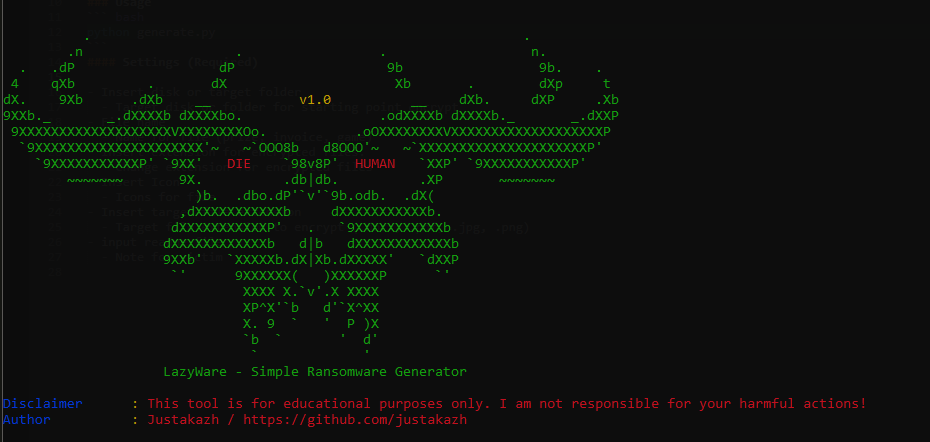

# LazyWare



**LazyWare** is a simple **ransomware generator** built using Python. This ransomware allows users to generate an executable file that can encrypt files in a specified target directory.

### ⚠️ Disclaimer

> **This tool is for educational purposes only! I am not responsible for any harmful actions taken with this tool. Use responsibly!**

[Virus Total Result](https://www.virustotal.com/gui/file/4bcb787291e56dcafbf643a5ef4621b2834519a79ad5dafe4b80661d79e6bf1e/detection)

## Features

- **Custom Target Disk/Folder**: Choose a specific disk or folder to encrypt.
- **Custom Icon**: Select a custom icon for the generated executable file.
- **Custom File Name**: Set the name for the generated file (e.g., prize.exe, invoice.exe).
- **Message to Victim**: Specify a message that will be displayed to the victim.
- **Custom Target File Types**: Choose which file types (e.g., .docx, .pdf, .jpg) to encrypt.
- **Automatic Extension Change**: Automatically changes the file extension after encryption.
- **Automatic Key Generation**: Generates a random encryption key automatically.
- **Automatic EXE File and Source Code Build**: Automatically generates an executable (.exe) from the Python source code.
- **Easy to Use**: Simple and user-friendly interface.

---

## Installation

To install and run LazyWare, ensure that you have Python version 3.12.7 or later installed.

1. Clone or download this repository.
2. Install the dependencies with the following command:

```bash
python -m pip install -r requirements.txt
```

## Dependencies

LazyWare requires the following Python libraries:

Python Version: `3.12.7`

```bash
colorama==0.4.6
cryptography==43.0.1
pyarmor==8.5.12
pyarmor.cli.core==6.5.3
pyinstaller==6.10.0
pyinstaller-hooks-contrib==2024.8
```

## Usage

Once the dependencies are installed, you can run the generator with the following command:

```bash
python generate.py
```

## Required Settings

1. When running generate.py, you will be prompted to configure the following settings:
2. Target Disk/Folder: Specify the disk or folder to be encrypted.
3. File Name: Set the name for the generated executable file (e.g., prize.exe, invoice.exe, game.exe).
4. Encrypted File Extension: Enter the extension for encrypted files (e.g., .encrypted).
5. Icon File: Choose the icon to use for the executable file.
6. Target File Extensions: Enter the file extensions you want to encrypt (e.g., .docx, .pdf, .jpg, .png).
7. Message for Victim: Enter a note that will be shown to the victim (usually in the form of a README file).

## Example Usage

Here's an example of how to use LazyWare:

1. Select the target disk/folder for encryption: C:/Users/Target/Documents/
2. Set the file name: invoice.exe
3. Set the extension for encrypted files: .locked
4. Choose an icon for the file: icon.ico
5. Set target file extensions for encryption: .docx, .pdf, .jpg
6. Write a README message to be displayed to the victim.

Once completed, the executable file will be generated with the provided settings.

## How It works?

After running the generator.py program, you will be guided through several configuration steps. Once the configuration is completed, the program will automatically generate two files: the ransomware encryptor (lib/source.py) and the decryptor (lib/source_de.py) based on the configuration you provided.

Next, the program will obfuscate the source code and compile it into an executable using pyarmor and pyinstaller. The open-source .py files, the compiled executable, and the KEY.txt file containing the encryption key will all be automatically generated in the output/ directory.
